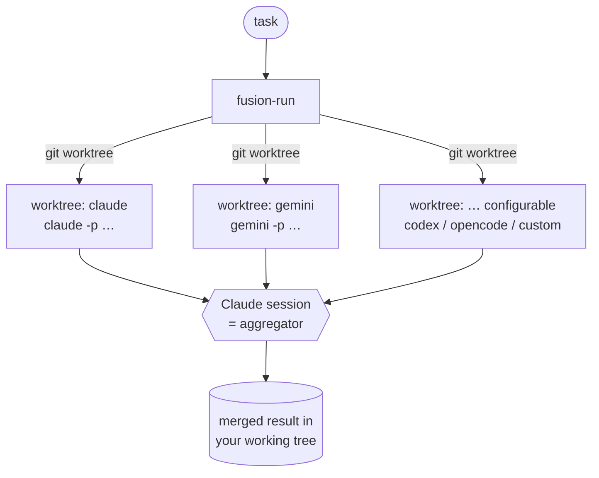

# fusion

A Claude Code plugin that brings the **fusion / mixture-of-agents** idea
(à la [OpenRouter's fusion API](https://openrouter.ai/)) to coding agents.

Instead of trusting a single model, fusion fans the *same* task out to several
independent agents — by default **Claude** and **Gemini CLI** — runs them **in
parallel**, then has your main Claude session act as the **aggregator** that
merges the best of each into one superior result.

The tricky part of running two autonomous agents at once is that they'd happily
overwrite each other's files. Fusion solves this with **git worktrees**: every
agent gets a private checkout on its own throwaway branch, so they're fully
isolated until you synthesize.



## Requirements

- A **git repository** (worktrees need it). `git init` if you haven't.
- The CLIs for whichever agents are in your roster, on `PATH`. Built-in agents
  (each runs in its own headless/non-interactive mode):

  | Agent | CLI | Headless invocation fusion uses |
  |---|---|---|
  | `claude` | [Claude Code](https://docs.claude.com/en/docs/claude-code) | `claude -p … --permission-mode bypassPermissions` |
  | `gemini` | [Gemini CLI](https://github.com/google-gemini/gemini-cli) | `gemini -p … --approval-mode yolo` |
  | `codex` | [OpenAI Codex CLI](https://github.com/openai/codex) | `codex exec --full-auto …` |
  | `opencode` | [opencode](https://github.com/sst/opencode) | `opencode run --dangerously-skip-permissions …` |

  Any other CLI with a headless mode can be added as a `custom` agent (see below).
  You only need the CLIs for agents you actually put in `FUSION_AGENTS`.

## Install

```text
/plugin marketplace add https://github.com/HainanZhao/agent-plugin-fusion.git
/plugin install fusion@fusion-marketplace
```

The repo doubles as its own marketplace (it ships a `.claude-plugin/marketplace.json`),
so there's nothing else to host.

> **Use the full `https://…` URL** above. The bare `owner/repo` shorthand
> (`/plugin marketplace add HainanZhao/agent-plugin-fusion`) also works, but if
> your git is configured to rewrite GitHub URLs to SSH it will try to clone over
> SSH and fail with *"SSH host key is not in your known_hosts file"* until you've
> run `ssh -T git@github.com` once. The HTTPS URL avoids that entirely.

For local development, point the marketplace at a checkout instead:
`/plugin marketplace add ./` from the repo root.

## Usage

```
/fusion add retry-with-backoff to the HTTP client and cover it with a test
```

This will:
1. Spin up one git worktree per agent and run them in parallel.
2. Capture each agent's transcript (`<agent>.log`) and applyable diff (`<agent>.diff`).
3. Have Claude study both, **synthesize** the best combined change into your
   working tree, and run your tests.
4. Report what it took from each agent, then clean up automatically.

### Picking the roster inline

Start the task with `@agent[:model]` tokens to add agents for a single run — no
env vars needed. **Claude is always folded in as the baseline**, so the agents
you name are fused *with* Claude:

```
/fusion @gemini:gemini-3.1-pro fix the race    # Claude + Gemini            (merge of 2)
/fusion @gemini @codex add a regression test   # Claude + Gemini + Codex    (merge of 3)
/fusion @claude:opus @gemini refactor auth     # Claude(opus) + Gemini  (Claude not doubled)
/fusion add retry logic                         # default roster: claude gemini
```

- Only `@tokens` naming a known agent (`claude`, `gemini`, `codex`, `opencode`,
  or one you've configured) are consumed — a task that genuinely begins with
  `@something` is left untouched.
- To drop the implicit Claude baseline (run only what you list), set
  `FUSION_BASE_AGENT=""`. To make a *different* agent the baseline, set it to that
  name.

### Cleanup is automatic

`/fusion` removes its own worktrees once the merge is applied (set `FUSION_KEEP=1`
to keep the raw candidates for inspection), and a SessionStart hook prunes any
stale runs left by interrupted sessions. Manual control if you want it:

```
/fusion-cleanup <RUN_ID>     # or: --all  |  --stale [HOURS]
```

## How isolation works

- Agents branch from `HEAD`, into `fusion/<runid>/<agent>` worktrees under
  `$TMPDIR/fusion-wt` (configurable). **Uncommitted changes in your main tree are
  not visible to the agents** — commit first if the task depends on them.
- Artifacts (logs, diffs, manifest) live under `.fusion/runs/<runid>/` in your
  repo; `.fusion/` is auto-added to `.git/info/exclude` so it never pollutes
  `git status`.
- Nothing touches your working tree until *you* (the aggregator) apply the merge.

## Configuration

Everything is environment-variable driven, so you can set it per-shell, in
`settings.json` `env`, or inline before `/fusion`.

| Variable | Default | Meaning |
|---|---|---|
| `FUSION_AGENTS` | `claude gemini` | Space-separated default roster (used when no inline `@agent` is given). |
| `FUSION_BASE_AGENT` | `claude` | Agent always folded into an inline `@agent` roster. Empty = no baseline. |
| `FUSION_KIND_<KEY>` | inferred | `claude` \| `gemini` \| `codex` \| `opencode` \| `custom`. Inferred from the name; anything unknown defaults to `custom`. |
| `FUSION_MODEL_<KEY>` | — | Model passed to that agent (e.g. `opus`, `gemini-2.5-pro`, `o4-mini`, `anthropic/claude-sonnet-4-6`). |
| `FUSION_EXTRA_<KEY>` | — | Extra raw CLI flags appended to a known-kind agent. |
| `FUSION_CMD_<KEY>` | — | For `kind=custom`: a command run via `bash -c` inside the worktree, with `$FUSION_PROMPT` / `$FUSION_MODEL` exported. |
| `FUSION_CLAUDE_PERM` | `bypassPermissions` | `claude --permission-mode`. Default gives all tools (incl. Bash) with no prompts; `acceptEdits` allows edits/grep/read but **blocks Bash** in headless mode. |
| `FUSION_GEMINI_APPROVAL` | `yolo` | `gemini --approval-mode` value. |
| `FUSION_CODEX_FLAGS` | `--full-auto` | Autonomy flags for `codex exec`. |
| `FUSION_OPENCODE_FLAGS` | `--dangerously-skip-permissions` | Autonomy flags for `opencode run`. |
| `FUSION_TIMEOUT` | `0` | Per-agent timeout in seconds (`0` = none). |
| `FUSION_BASE_REF` | `HEAD` | Git ref the worktrees branch from. |
| `FUSION_WORKTREE_DIR` | `$TMPDIR/fusion-wt` | Base dir for worktrees. |

`<KEY>` = the agent name upper-cased, non-alphanumerics → `_` (so agent `gpt-5`
reads `FUSION_KIND_GPT_5`, `FUSION_CMD_GPT_5`, …).

### Examples

Fan out across four mainstream agents:

```bash
export FUSION_AGENTS="claude gemini codex opencode"
export FUSION_MODEL_OPENCODE="anthropic/claude-sonnet-4-6"
/fusion add retry-with-backoff to the HTTP client and cover it with a test
```

Three agents — two Claudes at different models plus Gemini:

```bash
export FUSION_AGENTS="opus sonnet gemini"
export FUSION_KIND_OPUS=claude   FUSION_MODEL_OPUS=opus
export FUSION_KIND_SONNET=claude FUSION_MODEL_SONNET=sonnet
/fusion refactor the auth middleware
```

Swap Gemini for a custom agent (e.g. another CLI):

```bash
export FUSION_AGENTS="claude mycli"
export FUSION_KIND_MYCLI=custom
export FUSION_CMD_MYCLI='mycli run --model "$FUSION_MODEL" --task "$FUSION_PROMPT"'
export FUSION_MODEL_MYCLI=fast
/fusion …
```

## Files

```
.claude-plugin/plugin.json        plugin manifest
.claude-plugin/marketplace.json   makes it installable as a marketplace
commands/fusion.md                /fusion — orchestrate + synthesize
commands/fusion-cleanup.md        /fusion-cleanup — tidy worktrees/branches
scripts/fusion-run.sh             parallel fan-out into isolated worktrees
scripts/fusion-cleanup.sh         remove worktrees + throwaway branches
```

## Notes & caveats

- Each agent is a full headless coding session — fusion is **slower and more
  token/credit-hungry** than a single run. That's the trade for higher quality.
- Agents run with auto-approval (`--permission-mode acceptEdits`, `--approval-mode
  yolo`) so they can work unattended, but they're sandboxed to their worktree.
  Review the synthesized diff before committing, as always.
- The merge is done by Claude's judgment, not a mechanical `git merge`, so it can
  combine ideas that would otherwise conflict.
