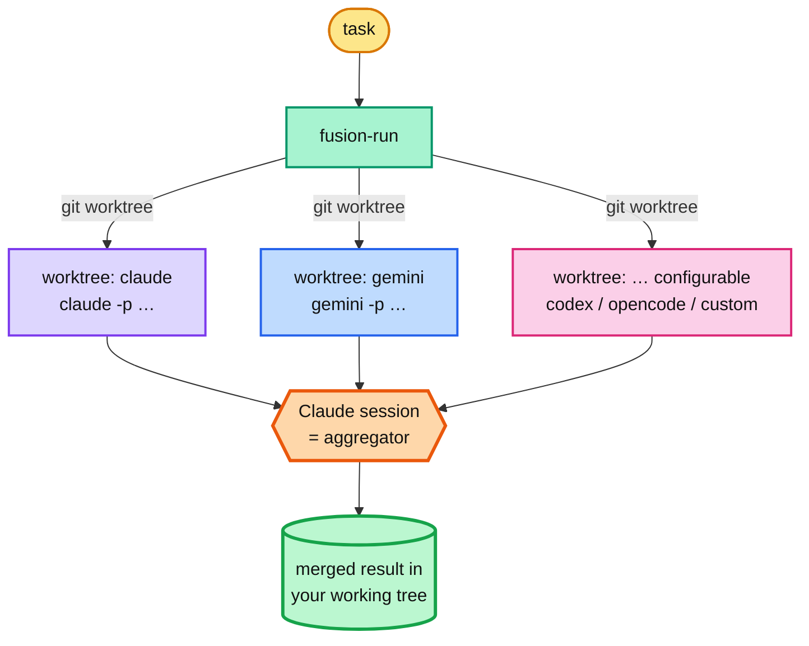

# fusion

A Claude Code plugin that brings the **fusion / mixture-of-agents** idea (à la
[OpenRouter's fusion API](https://openrouter.ai/)) to coding agents: fan the
*same* task out to several agents in **parallel**, each isolated in its own **git
worktree**, then let your Claude session **synthesize** the best combined result.



## Install

Run these **one at a time** (not as a single paste). First add the marketplace:

```text
/plugin marketplace add https://github.com/HainanZhao/agent-plugin-fusion.git
```

then install the plugin:

```text
/plugin install fusion@fusion-marketplace
```

Use the full `https://…` URL (the `owner/repo` shorthand can clone over SSH and
fail until you've run `ssh -T git@github.com` once). For local dev:
`/plugin marketplace add ./`.

The commands are **`/fusion:run`** and **`/fusion:cleanup`** (plugin commands are
always `plugin:command`). To type just **`/fusion`**, drop the included wrapper
into your user commands:

```bash
mkdir -p ~/.claude/commands && curl -fsSL \
  https://raw.githubusercontent.com/HainanZhao/agent-plugin-fusion/main/extras/fusion.md \
  -o ~/.claude/commands/fusion.md
```

(or copy `extras/fusion.md` from a local checkout). It just forwards to
`/fusion:run`.

**Requires** a git repo plus the CLIs for the agents you use. Built-ins (each run
headless): `claude`, `gemini`, `codex`, `opencode`. Any other headless CLI works
as a `custom` agent.

## Usage

```text
/fusion add retry-with-backoff to the HTTP client and cover it with a test
```

Spins up one worktree per agent, runs them in parallel, then synthesizes the best
combined change into your working tree and cleans up.

### Picking the roster inline

Prefix the task with `@agent[:model]` tokens. **Claude is always folded in**, so
named agents are fused *with* Claude:

```text
/fusion @gemini:gemini-3.1-pro fix the race    # Claude + Gemini          (merge of 2)
/fusion @gemini @codex add a test              # Claude + Gemini + Codex  (merge of 3)
/fusion @claude:opus @gemini refactor auth     # Claude(opus) + Gemini    (no dup)
/fusion add retry logic                         # default roster: claude gemini
```

Only `@tokens` naming a known/configured agent are consumed. Set
`FUSION_BASE_AGENT=""` to drop the implicit Claude baseline.

### Cleanup

Automatic: `/fusion:run` cleans its own run (set `FUSION_KEEP=1` to keep
candidates), and a SessionStart hook prunes stale runs. Manual:
`/fusion:cleanup <RUN_ID> | --all | --stale [HOURS]`.

## How isolation works

Agents branch from `HEAD` into `fusion/<runid>/<agent>` worktrees (so
**uncommitted changes aren't seen** — commit first if needed). Artifacts live in
`.fusion/runs/<runid>/` (auto-excluded from git). Nothing touches your working
tree until the aggregator applies the merge.

## Configuration

All via environment variables (`<KEY>` = agent name upper-cased, non-alphanumerics
→ `_`).

| Variable | Default | Meaning |
|---|---|---|
| `FUSION_AGENTS` | `claude gemini` | Default roster (when no inline `@agent`). |
| `FUSION_BASE_AGENT` | `claude` | Agent always added to an inline roster. Empty = none. |
| `FUSION_KIND_<KEY>` | inferred | `claude`\|`gemini`\|`codex`\|`opencode`\|`custom`. |
| `FUSION_MODEL_<KEY>` | — | Model for that agent (e.g. `opus`, `o4-mini`). |
| `FUSION_EXTRA_<KEY>` | — | Extra CLI flags for a known-kind agent. |
| `FUSION_CMD_<KEY>` | — | `custom` agent command (`bash -c`, with `$FUSION_PROMPT`/`$FUSION_MODEL`). |
| `FUSION_CLAUDE_PERM` | `bypassPermissions` | `claude --permission-mode` (full tools; `acceptEdits` blocks Bash headless). |
| `FUSION_GEMINI_APPROVAL` | `yolo` | `gemini --approval-mode`. |
| `FUSION_CODEX_FLAGS` | `--full-auto` | `codex exec` autonomy flags. |
| `FUSION_OPENCODE_FLAGS` | `--dangerously-skip-permissions` | `opencode run` autonomy flags. |
| `FUSION_TIMEOUT` | `0` | Per-agent timeout (s); `0` = none. |
| `FUSION_BASE_REF` | `HEAD` | Ref the worktrees branch from. |
| `FUSION_WORKTREE_DIR` | `$TMPDIR/fusion-wt` | Worktree base dir. |

```bash
# four agents; two Claudes at different models + Gemini; or a custom CLI
export FUSION_AGENTS="claude gemini codex opencode"
export FUSION_AGENTS="opus sonnet gemini" FUSION_KIND_OPUS=claude FUSION_MODEL_OPUS=opus
export FUSION_KIND_MYCLI=custom FUSION_CMD_MYCLI='mycli run --task "$FUSION_PROMPT"'
```

## Notes

- Each agent is a full headless session — fusion is slower and more
  token/credit-hungry than one run; that's the trade for quality.
- Agents auto-approve tools but are sandboxed to their worktree. Review the
  synthesized diff before committing.
- The merge is Claude's judgment, not a mechanical `git merge`, so it can combine
  ideas that would otherwise conflict.
